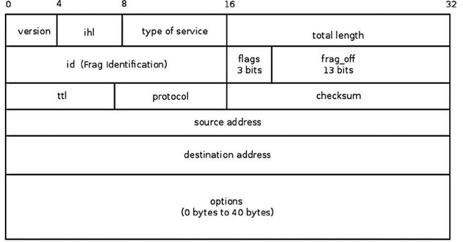

## 会覆盖到的内容
1. IPv4简介
2. IPv4在内核的执行
   1. 发送和接收IPv4包
      1. 广播包
      2. IPv4转发
   2. 当发送的包大于MTU，需要对该包做分片(fragment)
   3. 组装之前分片的包

## IPv4简介
IPv4协议是今天互联网的核心协议之一，并且它路由了互联网的大部分流量。它在两台主机之间提供了端到端的连通性，并且具有转发包（路由）的功能。

### IPV4头
每个IPv4包都以IP头开始，大小为20-60字节(bytes),一般来说都是20字节，除非*ip options*被使用，才可能到60字节。相比IPv6,其头大小固定是40字节。IPv4 header的结构如下图。


IP头之后就是传输层的头，紧接着就是需要传输的数据(payload)。

IPv4头包含了内核如何处理该包的信息，使用的协议，源/目的Ip地址，校验和，和为了分片的id，和ttl避免一个包被无止境的转发。这些信息存储在*iphdr*结构体中，该结构体定义在源码的**include/uapi/linux/ip.h** 下，该结构如下
```c
struct iphdr {
#if defined(__LITTLE_ENDIAN_BITFIELD)
	__u8	ihl:4,  // Internet Header Length 表示header大小是多少(20-60 bytes)
		version:4;
#elif defined (__BIG_ENDIAN_BITFIELD)
	__u8	version:4,
  		ihl:4;
#else
#error	"Please fix <asm/byteorder.h>"
#endif
	__u8	tos;  // type of server
	__be16	tot_len;  // total length, 包括头的总大小
	__be16	id;  // sk_buffer分片的包，其id都相同，组装依赖该字段
	__be16	frag_off; // flags: high 3 bits(001 More fragments, set to all frags, except the last one, 010 Don't Fragment, 100 Congestion), flag_off: lower 13 bits
	__u8	ttl;  // time to live, each forwarding decreases the ttl by 1, when it reaches 0, the packet is discard
	__u8	protocol;  // L4 protocol of the package
	__sum16	check;
	__be32	saddr;
	__be32	daddr;
	/*The options start here. 
	注意只有前面的字段是必须的， options字段是可选的
	*/
};
```

[//]: # (### IPv4初始化)

[//]: # (IPv4在L2层的头被标记为0x0800&#40;存储在L2的头中&#41;，然后依据头部信息中的L4协议调用对应的处理函数)

### 接收IPv4包
接收函数位于`net/ipv4/ip_input.c/ip_rcv`,它会处理所有的IPv4包，包括多拨和广播