保密(Confidentiality)是为了私密数据不被别人看到，而加密是实现这一目标的方法。说到密码学我们大多数值得就是加密，因为它确实无处不在，它在现代社会中
很多地方都有它来提供隐私和安全。在本文中，我会介绍到加密是什么，它解决了什么问题以及今天的应用程序是如何大量使用加密的。

## 密码(cipher)是什么？

It’s like when you use slang to talk to your siblings about what you’ll do after school so
your mom doesn’t know what you’re up to. 这句话是reddit r/crypto版主的原话。
现如今的通信都要通过媒介传输，但是这些媒介默认是不安全的(消息可以被偷窥，
消息能被篡改)。为了防止消息被偷窥，我们需要加密算法(encryption algorithm also called cipher)。通过加密，原始明文变得随机。

为了实现加密，我们需要有

1. 密钥(secret key), 加密算法提供的安全性很大依赖于密钥的私密性(一旦创建之后，只有自己能读400)。
2. 原始明文(plaintext)。

有了私密和明文，加密就能产生出一个密文(ciphertext)。有了密文，我们就可以让他在不安全的媒介上传输了。接收方收到密文后，就可以使用密钥来解密密文以获取
原始明文。

下图是一个加密算法的示例图片：
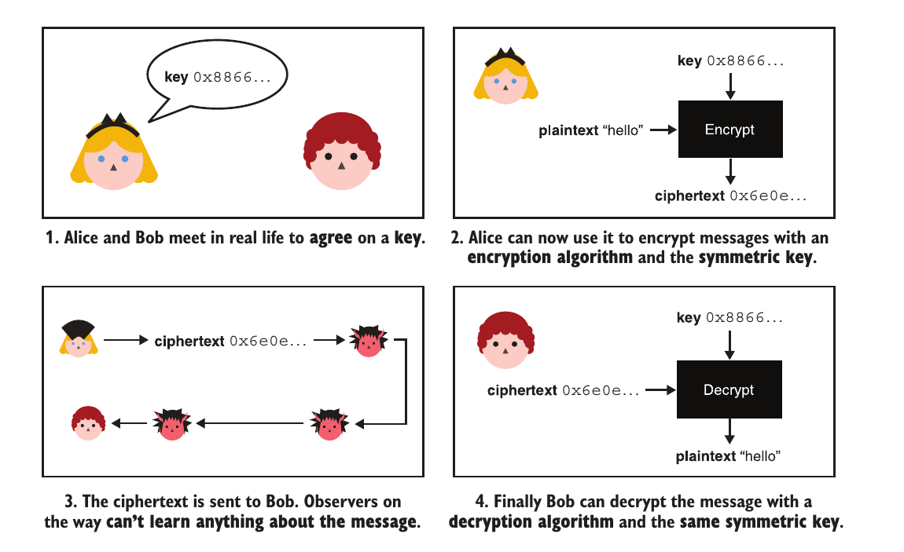
看到这里就有疑惑了，那这个密钥alice如何安全的给bob了？假如只依靠单个密钥那就是[先有鸡还是先有蛋](https://zh.m.wikipedia.org/zh-sg/%E5%85%88%E6%9C%89%E9%B8%A1%E8%BF%98%E6%98%AF%E5%85%88%E6%9C%89%E8%9B%8B)
.因此为了解决这个问题，又有了密钥交换算法。

## 高级加密标准(Advanced Encryption Standard)

1997年，[NIST](https://en.wikipedia.org/wiki/National_Institute_of_Standards_and_Technology)开始了AES公开竞争以取代Data
Encryption Standard(DES)
,三年期间有15个不同的设计被提交，最终[Rijndael](https://zh.wikipedia.org/zh-cn/%E9%AB%98%E7%BA%A7%E5%8A%A0%E5%AF%86%E6%A0%87%E5%87%86)
由Vincent Rijmen和Joan Daemen设计的成为最终赢家。在2001年成为标准。
**bit security**用来描述一个加密算法提供的安全级别。AES-128能够提供128位的安全性，也就是pow(2,128)
次操作，这和之前介绍的SHA-128不一样，SHA-128只能提供64位的[安全](https://zh.wikipedia.org/wiki/%E7%94%9F%E6%97%A5%E6%94%BB%E5%87%BB)
。pow(2, 128)有多大，用英文表示出来给大家展示一下。
340 undecillion 282 decillion 366 nonillion 920 octillion 938 septillion 463 sextillion 463 quintillion 374 quadrillion
607
trillion 431 billion 768 million 211 thousand 456

### AES提供的接口

拿AES-128举例

1. 可变长度的key
2. 固定长度(128bits/16bytes)的原文
3. 输出固定长度(128bits/16bytes)的密文

因为AES接受固定长度的原文，因此也可以叫他块加密(block cipher)
。技术上来说，当你的key固定且原文的长度固定，它输出的密文是一种排列(permutation).
改变key，就会改变这个映射。排列也是可逆的，因此AES的加密和解密操作都是确定性的(deterministic)。映射关系如下图：
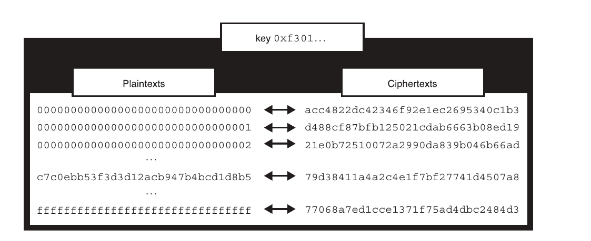

### AES内幕(internal)

AES是一种块加密算法(加密固定长度的块)，我们以AES-128举例。它先将16字节的明文转换成一个4*4的矩阵，如下图。
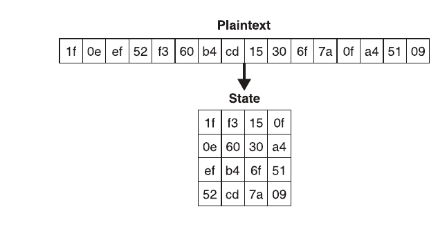
然后经过`round function`，每次得到一个`state`最终得到密文，如下图。
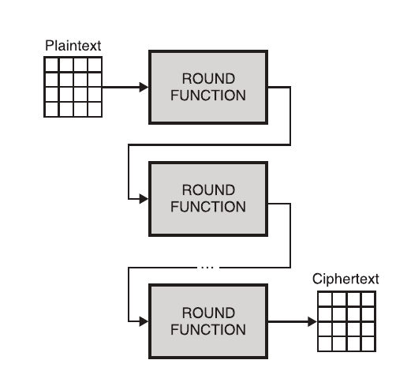
AES-128会经过十轮。每轮会使用不同的`round key`,它来自于原始的`secret key`,这一过程叫做`key scheduler`。
每一轮可以分成四个步骤：

1. SubBytes
2. ShiftRows
3. MixColumns
4. AddRoundKey

这四种运算都是可逆的，前三种可以简单的看作"矩阵的初等变换",最后一步它执行的是将当前的`state`和`round key`
进行异或运算。为什么第四种也是可逆的？
这是因为(a^b^b) = a^0 = a。下图是`round function`的示意图。
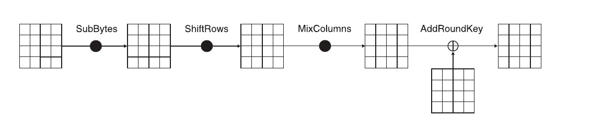
由于AES太常见了，现在的cpu都基于`AES-NI`直接提供了硬件支持。

### 如何加密不是128bits的明文？

明文不可能总是128bits的，那么AES是如何解决这个问题的了？

#### 填充(padding)

假如我们要加密长文本，我们先将长文本划分为16bytes的块，如果最后一部分少于16字节，我们就需要填充。有很多填充的方式，但是一定要保证填充是可逆的，要不然就不能解密了。
解密的时候我们要能够去掉填充获得原始的未填充的明文。最流行的填充机制是[PKCS#7](https://en.wikipedia.org/wiki/PKCS_7)
.它依据如下规则进行填充：
填充的字节必须是需要填充的长度。如下图，我们需要填充8字节数据，因此填充的字节就是0x08。
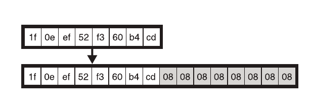

填充完就需要对每一块进行加密了，这就引入了分组密码工作模式的概念。

#### 分组密码工作模式(mode of operation)

##### [电子密码本(ECB)](https://zh.wikipedia.org/wiki/%E5%88%86%E7%BB%84%E5%AF%86%E7%A0%81%E5%B7%A5%E4%BD%9C%E6%A8%A1%E5%BC%8F#%E7%94%B5%E5%AD%90%E5%AF%86%E7%A0%81%E6%9C%AC%EF%BC%88ECB%EF%BC%89)。但是该方法的缺点在于同样的明文块会被加密成相同的密文块;因此他不能很好的隐藏数据。下图是一个很著名的列子(ECB penguin)。

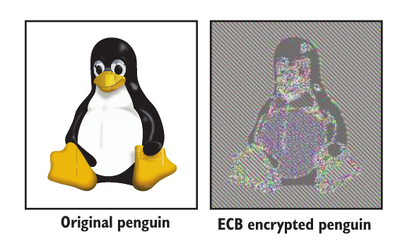

##### [密码块链接（CBC）](https://zh.wikipedia.org/wiki/%E5%88%86%E7%BB%84%E5%AF%86%E7%A0%81%E5%B7%A5%E4%BD%9C%E6%A8%A1%E5%BC%8F#%E5%AF%86%E7%A0%81%E5%9D%97%E9%93%BE%E6%8E%A5%EF%BC%88CBC%EF%BC%89)·

为了解决ECB的问题，1976年IBM发明了`Cipher-block chaining`
。在CBC模式中，每个明文块先与前一个密文块进行异或后，在进行加密。在这种方法中，每个密文块都依赖于它前面的所有明文块。同时，为了保证每条消息的唯一性，在第一个块中需要使用初始化向量。

下图是CBC加密的流程图
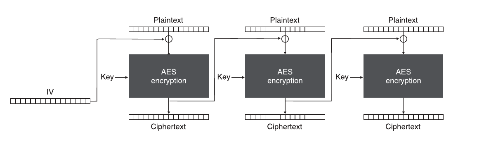

下图是CBC解密的流程图
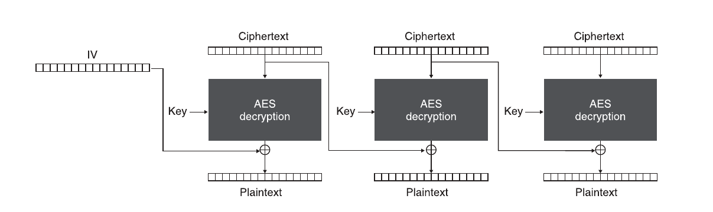

有了填充和操作模式并不足以使一个加密可用！这是为什么捏？因为缺乏完整性校验。

### AES-CBC-HMAC

在cbc操作模式中，初始化向量`IV`是可以被伪造的。这会造成什么后果了？下图是一个`位翻转攻击fliping attacker`的例子。

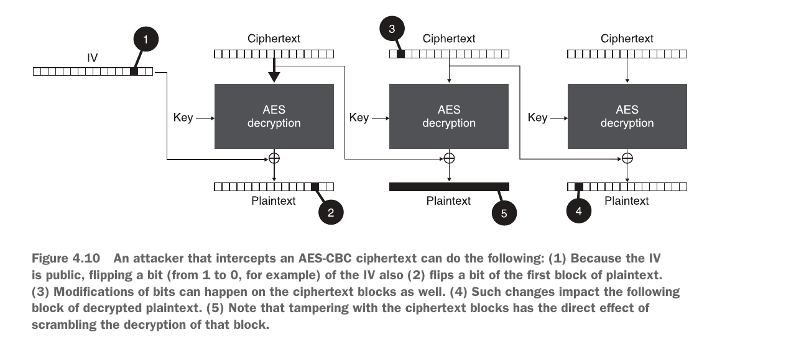
位翻转攻击可以发生在上图中的1-4，修改了传输的密文，最终就会导致最终的解密失败。那有没有办法防止密文被修改了？`MAC`
站了出来。下面直接给出AES-CBC-HMAC的构造示意图。
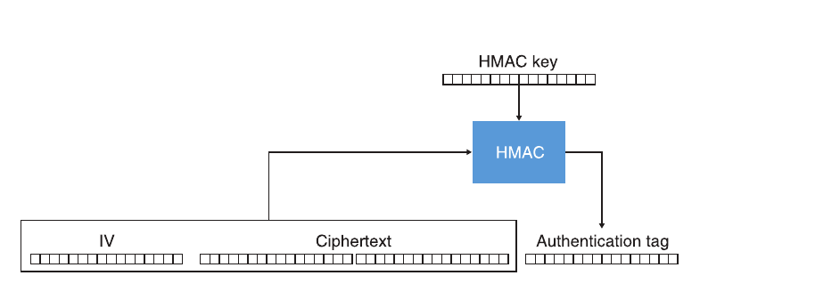

## 认证加密

有了上面的介绍，我们知道加密的历史并不是完美的。

1. 只加密没有验证是危险的。
2. 滥用认证。

最新的数据加密方式采用的`all-in-one`
构造叫做[aead](https://en.wikipedia.org/wiki/Authenticated_encryption#Authenticated_encryption_with_associated_data_(AEAD))
。它不仅给明文数据提供了私密性，也能够监测到任何对
密文的修改。此外它还提供了一种认证`associated data`的方式。

什么是`associated data`？它是可选的，它也可以提供包含原文相关的元信息用在加密和解密。该数据不会被加密，他和密文一起被传输。

那么什么又叫做`all-in-one`呢？请看下图
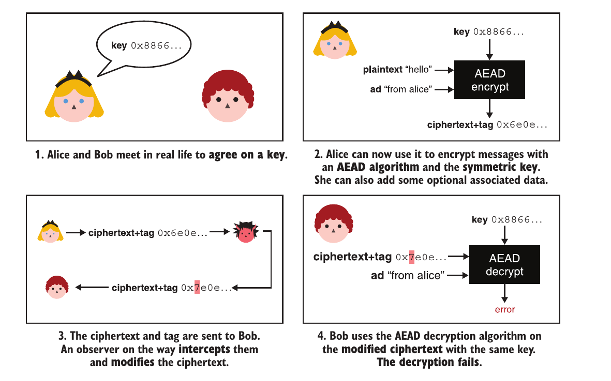

下面是一个使用js和和[Web Crypto API](https://developer.mozilla.org/zh-CN/docs/Web/API/Web_Crypto_API)使用`AES-GCM`加密和解密的例子。
```js
let config = {

    name: 'AES-GCM',

    length: 128
};
let keyUsages = ['encrypt', 'decrypt'];
let key = await crypto.subtle.generateKey(config, false, keyUsages);
let iv = new Uint8Array(12);
await crypto.getRandomValues(iv);

let te = new TextEncoder();
let ad = te.encode("some associated data");

let plaintext = te.encode("hello world");


let param = {
    name: 'AES-GCM',
    iv: iv,
    additionalData: ad
};
let ciphertext = await crypto.subtle.encrypt(param, key, plaintext);
let result = await window.crypto.subtle.decrypt(
    param, key, ciphertext);
new TextDecoder("utf-8").decode(result);
```


因此有了两种广泛采用的认证加密标准`AES-GCM`和[ChaCha20-Poly1205](https://en.wikipedia.org/wiki/ChaCha20-Poly1305)
