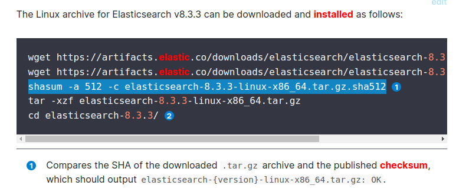
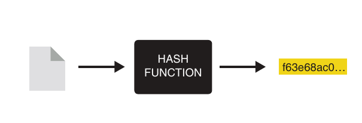
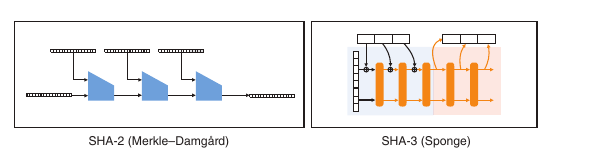

## 简介
接收任意数据作为输入，返回独一无二的字节数组。输入相同，输出总是一致的。

### 什么是哈希？
如果我们下载[es](https://www.elastic.co/guide/en/elasticsearch/reference/current/targz.html), 会看到 
它就是用sha512计算该文件的哈希值，随后用户可以利用该哈希值来判断下载的文件是否**完整**。这种机制它们提供完整性和真实性(你信任该网站，通过https)。
下图是哈希的一般流程。

其中输入可以是任意长度的输入，音视频，图片等等。产生固定长度的输出，256 bit表示SHA-256.
一些例子
```shell
#echo -n "hello guys" | openssl dgst -sha256
(stdin)= cc1ad2c685e6521a4eebcb5da8c8b82ed49cd4a93717cc80e91aeb29046b2cfb
echo -n "hello guys" | openssl dgst -sha256
#(stdin)= cc1ad2c685e6521a4eebcb5da8c8b82ed49cd4a93717cc80e91aeb29046b2cfb
echo -n "hella guys" | openssl dgst -sha256
#(stdin)= 0672c10004b4bf76bef963022a54eb4dcf322a1e416eef0cdb07b20cb0844bf2
```


### 哈希函数具备的属性
1. [原像抗性](https://zh.wikipedia.org/wiki/%E5%8E%9F%E5%83%8F%E6%94%BB%E5%87%BB)(pre-image resistance)，对于所有预设输出，从计算角度应无法找到符合输入哈希的输出。例如，给定y，使得很难找到满足h(x) = y的x。
2. 次原像抗性(second pre-image resistance) 从计算角度无法找到任何与特定输入值有着相同输出的二次输入值。例如，给定x，使得很难找到满足h(x) = h(x′)的次原像x′ ≠ x。（Note: 实践不可能并非理论不可能，举例，sha-256总共就有pow(2, 256)种可能）
3. 碰撞抗性(collision resistance) 抗碰撞性是指无法从计算角度找到任何两个哈希值都相同的独特输入x，例如h(x) = h(x′)

<details>
  <summary>hash的输出长度</summary>
hash的输出长度并不是其必备的属性之一，但是为了满足属性123,实践中hash的输出长度至少应该是256bit,即32字节。256bit提供了最低128bit的 <a href="https://zh.wikipedia.org/wiki/%E7%94%9F%E6%97%A5%E6%94%BB%E5%87%BB">安全性</a>
</details>

### hash 实践

#### commitment scheme

承诺方案是一种加密原语，它允许用户承诺选定的值，同时使其他人看不到该值，并能够在以后公开所承诺的值。承诺方案的设计是为了使当事方在承诺之后不能更改价值或陈述


#### 子资源完整性[Subresource integrity](https://developer.mozilla.org/en-US/docs/Web/Security/Subresource_Integrity)
应用场景
1. 网站使用cdn引入一些js库


```javascript
<script src="https://example.com/example-framework.js"
        integrity="sha384-oqVuAfXRKap7fdgcCY5uykM6+R9GqQ8K/uxy9rx7HNQlGYl1kPzQho1wx4JwY8wC"
        crossorigin="anonymous"></script>
```

#### [BitTorrent](https://zh.wikipedia.org/wiki/BitTorrent_(%E5%8D%8F%E8%AE%AE))
用户(peers)通过BitTorrent协议直接与其他用户(p2p)共享文件。为了共享某个文件，先分块(chuck)计算各自的hash,然后将该hash作为该块文件的标识。这样做最主要的用处是，某个用户可以从不同的用户那里下载到不同的chucks. 

> magnet:?xt=urn:btih:b7b0fbab74a85d4ac170662c645982a862826455


#### TOR

技术无罪，但是该项技术总是和一些不美好的东西联系起来，就不说了，感兴趣的自己看看吧:)

### 标准化的hash函数
之前我们已经提及了SHA-256和看过了es的SHA-512,这里我们会详细的介绍hash函数的工作原理，以及它们的区别。[**MD5**](https://eprint.iacr.org/2004/199.pdf)和 [**SHA-1**](https://security.googleblog.com/2017/02/announcing-first-sha1-collision.html)今日已经不再推荐使用，因为它们的安全性不够高。因此不再介绍

#### 更安全的hash算法
**SHA-2**和**SHA-3**是当今更广泛使用的两类hash算法，其构造示意图如下

### hash未解决的问题
1. 他并没有能力证明自身的完整性