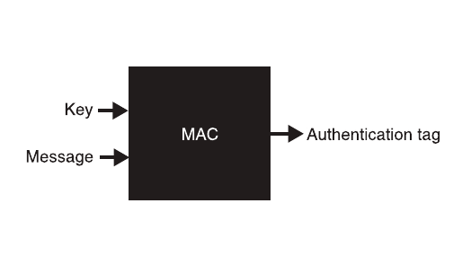
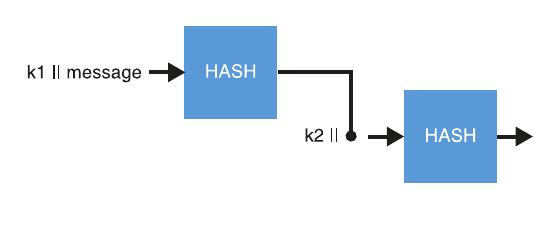
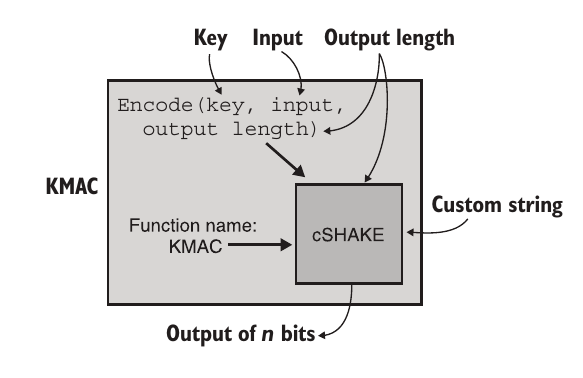
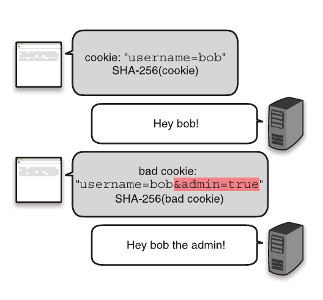
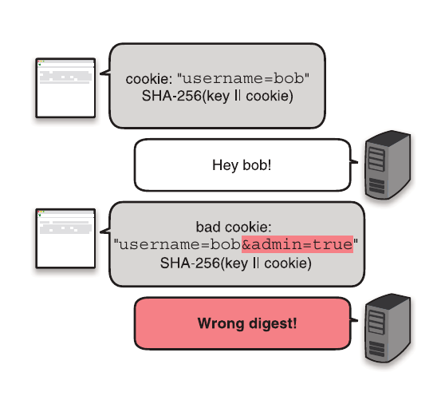

## 简介
消息认证码(英语：Message authentication code，缩写为MAC),又译为消息鉴别码、文件消息认证码、讯息鉴别码、信息认证码，是经过特定算法后产生的一小段信息，检查某段消息的完整性，以及作身份验证。**它可以用来检查在消息传递过程中，其内容是否被更改过**，不管更改的原因是来自意外或是蓄意攻击。同时可以作为消息来源的身份验证，确认消息的来源。

## 基本原理




其中的MAC可以是hash函数，也可以是TODO。MAC有点像私密的只有你知道密钥的哈希函数。

### 代码样例
```go
package crypto_mac

import (
	"crypto/hmac"
	"crypto/rand"
	"crypto/sha256"
	"testing"

	"github.com/stretchr/testify/require"
)

func TestMac(t *testing.T) {
	const (
		size    = 32
		message = "salary:88888"
	)
	key := make([]byte, size)
	ri, err := rand.Read(key)
	require.Equal(t, size, ri)
	require.NoError(t, err)
	
	// sign
	h := hmac.New(sha256.New, key)
	h.Write([]byte(message))
	authTag := h.Sum(nil)

	// verify
	mac := hmac.New(sha256.New, key)
	mac.Write([]byte(message))
	got := h.Sum(nil)
	require.True(t, hmac.Equal(authTag, got))
}
```


## 使用场景
1. 保证通信双方的消息未被篡改.
2. 派生密钥(Deriving keys).
3. cookie的完整性(Integrity of cookies).
4. [Hash Table](https://en.wikipedia.org/wiki/Collision_attack#Hash_flooding)


## 实践

### HMAC

1. 由key,ipad(常量0x35)和opad(常量0x5c)创建两个key，k1(key xor ipad)和k2(key xor opad)
2. res = Hash(concat(key, k1, message))
3. final authentication tag = Hash(concat(key, k2, res))



### KMAC(a MAC based on cSHAKE)


## SHA-2 and length-extension attacks

